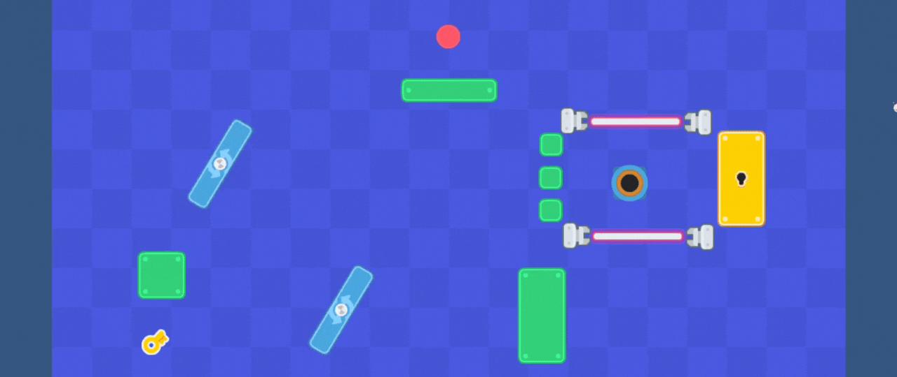

# 🎮 Jogo da Bolinha — Protótipo Unity 2D 
   

Protótipo de jogo 2D desenvolvido com Unity durante o curso [**"Desenvolvendo Jogos com Unity 2D"**](https://www.youtube.com/watch?v=59Z-E2yt2oA&list=PLzjwaizNOg6TltKzv_WWX3EJosl5nA46m&index=11) no YouTube.

Este projeto teve como objetivo aprender conceitos básicos de Unity, desenvolvimento de jogos, programação em C#, movimentação e física 2D.

---

## 📑 O que aprendi nesse projeto:

☞  Criar um projeto novo 2D no Unity   
☞  Importar e organizar assets (sprites, sons e cenas)   
☞  Configurar Rigidbody2D e Colliders para objetos no Unity   
☞  Programar movimentação da bolinha usando C#   
☞  Detectar colisões com obstáculos e plataformas   
☞  Implementar troca de cenas   
☞  Organizar hierarquia de objetos e estrutura de pastas no Unity   

---

# Preview 🎥

